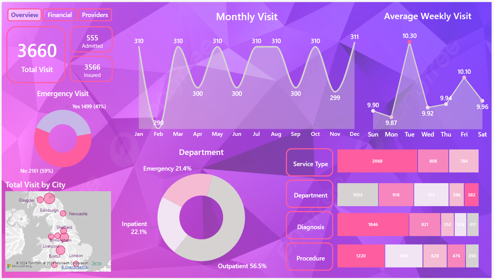
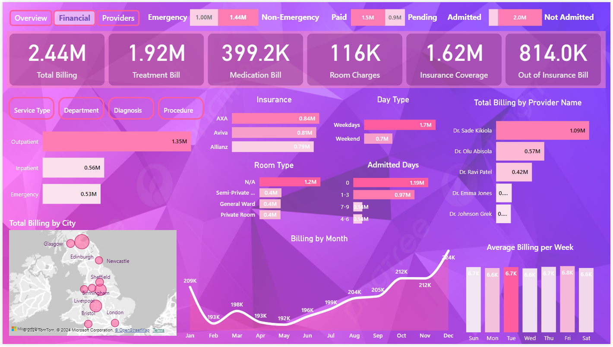
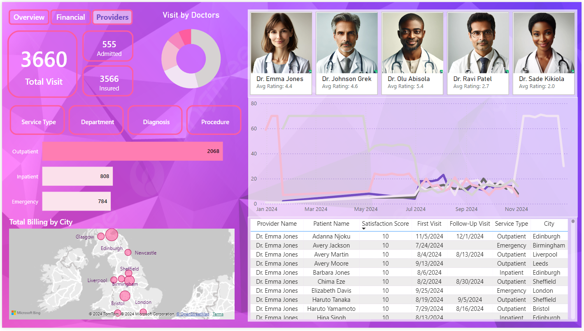

# Healthcare Report Data Analysis

An online shopping store request to improve their current sales report from static report to dynamic visual reports / dashboard. Additionally, they want to include in the new dashboard their latest online sales report and compared it from the previous year. They want to see how many products are being sold, where it was sold and how many of them are sold to a specific customer.

## Business Demand 

### Overview

- Requested by: Sales Manager
- Change Request: Visual dynamic dashboards with improvde Sales reporting metrics
- Application/Software: Power BI, SQL, Excel
- Other relevant Infos: Excel dataset (Budget 2021), SQL Database access

<b>Key points:</b>
- Analyze into more details the following KPIs Total sales, total budget alloted, difference of alloted budget from sales, total sold product.
- Display how much products sold to which client and how it has been over time.
- Sales manager / Sales person (viewer and user) should be able to filter reports by date, months, customer, product, category and city.
- Provide dashboard to display all the reports that can be refreshed every time they have new data.
